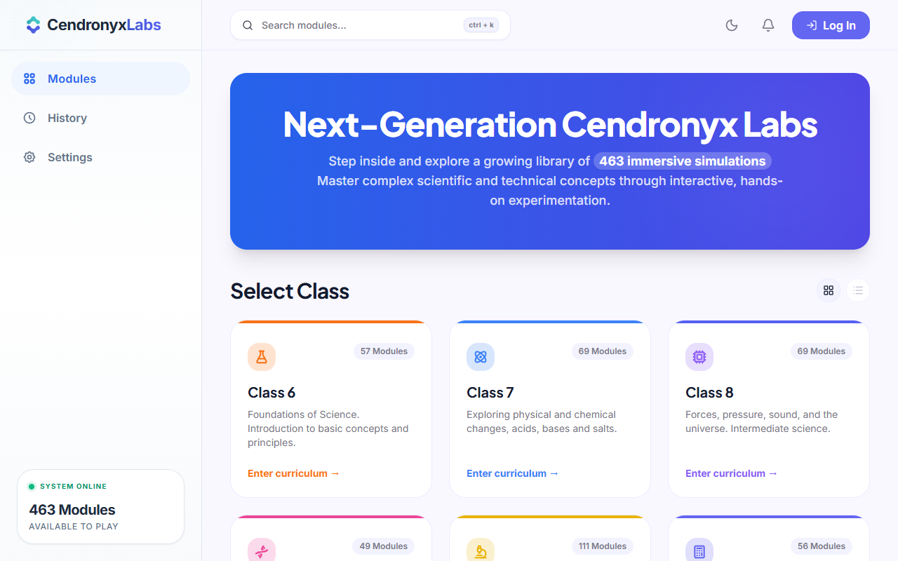
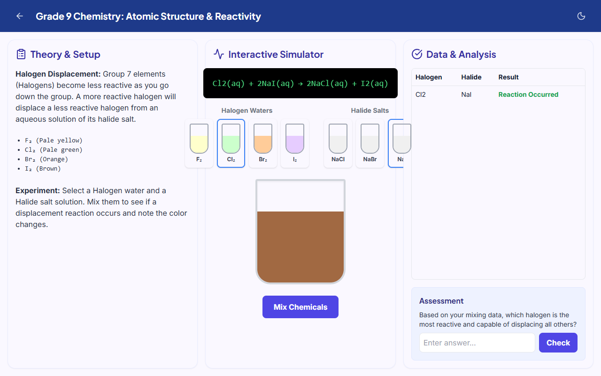

# Cendronyx Labs (VirtualLab)

  
  
  
  
  
  
  
  
  

> **Cendronyx Labs is an offline-first Progressive Web App delivering 571+ interactive simulations and an AI-Powered Simulation Maker for Science, Mathematics, Computer Science, and English, aligned with Grades 6–12 curricula. Built with bilingual support (English, Urdu & Roman Urdu) and instant client-side persistence, it brings interactive lab experimentation to every classroom.**

---

## 📑 Table of Contents

- [Platform at a Glance](#-platform-at-a-glance)
- [Vision](#-vision)
- [Live Demo](#-live-demo)
- [Screenshots](#-screenshots)
- [✨ What's New: AI Simulation Maker Studio](#-whats-new-ai-simulation-maker-studio)
- [🌐 Multilingual Support (Urdu & Roman Urdu)](#-multilingual-support-urdu--roman-urdu)
- [Key Features](#-key-features)
- [App Architecture & Core Engines](#-app-architecture--core-engines)
- [Offline-First & PWA Architecture](#-offline-first--pwa-architecture)
- [Curriculum Breakdown](#-curriculum-breakdown)
- [Technology Stack](#-technology-stack)
- [Roadmap](#-roadmap)

---

## 📊 Platform at a Glance

- 🎓 **Grades Supported**: 6–12
- 📚 **Subjects**: 7 (Physics, Chemistry, Biology, Mathematics, Computer Science, Science, English)
- 🧪 **Interactive Labs**: 571+ Pre-built Modules + Unlimited AI Generated Labs
- 🤖 **AI Studio**: Natural Language Prompt-to-Simulation Generator (OpenRouter & Gemini 2.0 API)
- 🇵🇰 **Languages**: English, Urdu (`ur`), and Roman Urdu (`ur-roman`)
- 💾 **Local Storage**: IndexedDB (Version 7) Custom Simulation Persistence
- 🌐 **Offline-First PWA**: Installable on Windows, macOS, Linux, Android, iOS & Chromebooks

---

## 👁️ Vision

To make high-fidelity interactive STEM and language education accessible to every student, regardless of internet connectivity, budget, or laboratory resources.

---

## 🚀 Live Demo

Try Cendronyx Labs now — no installation required:

> **Note:** For full offline capability, install the app as a PWA directly from your browser menu.

---

## 🤖 What's New: AI Simulation Maker Studio (`/ai-maker`)

Cendronyx Labs features a **Prompt-to-Simulation AI Generator Studio** that allows teachers and students to create customized interactive science and math labs on the fly using natural language:

- **Prompt-to-Lab Generation**: Enter any physics, chemistry, or math concept (e.g. *"Show Newton's 3rd law with action-reaction force vectors"*, *"Harmonic spring pendulum oscillator"*).
- **Live OpenRouter & Gemini AI Models**: Powered by top AI models including:
  - `google/gemma-4-31b-it:free`
  - `google/gemma-4-26b-a4b-it:free`
  - `nvidia/nemotron-3-super-120b-a12b:free`
  - `cohere/north-mini-code:free`
  - `google/lyria-3-pro-preview`
  - Direct Google Gemini 2.0 Flash Free API Key support
- **AST JSON Engine**: AI generates a full AST specification containing theory summaries, variable sliders, computed formulas, canvas 2D physics primitives, chart telemetry, LaTeX derivations, and quizzes.
- **Continuous 2D Physics Visualizer**: Features a real-time HTML5 2D canvas runner with automatic harmonic motion fallback so generated simulations are always dynamically moving.
- **IndexedDB Local Storage & Shareable Links**: Save generated labs locally (`VirtualLabDB` v7) or generate shareable direct links (`/lab/custom/:id`).

---

## 🌐 Multilingual Support (Urdu & Roman Urdu)

To maximize accessibility for students across Pakistan and South Asia, Cendronyx Labs includes a complete localization engine:

- **English**: Original curriculum standard.
- **Urdu (اردو)**: Full Nastalioq Urdu translations for derivations, lab theory, interactive controls, and quizzes across Class 9–12 Physics, Chemistry, Math, and Computer Science.
- **Roman Urdu**: Easy-to-read Roman Urdu translation for students comfortable with Latin script transliteration.

---

## 📸 Screenshots

| Home Page | AI Simulation Maker |
|:---:|:---:|
|  |  |

| Interactive Lab Visualizer | Mobile View |
|:---:|:---:|
|  |  |

---

## ✨ Key Features

- ✅ **571+ pre-built interactive virtual labs** spanning Grades 6–12.
- ✅ **AI Simulation Maker Studio** for instant prompt-based lab creation.
- ✅ **Bilingual Nastalioq Urdu & Roman Urdu localization**.
- ✅ **Offline-First Progressive Web App** architecture.
- ✅ **Interactive 2D Physics Visualizer** (Pendulums, Springs, Waves, Projectiles, Circuits, Action-Reaction vectors).
- ✅ **Step-by-step LaTeX formula derivation runner** with step progress.
- ✅ **Real-time telemetry chart visualizer** logging $x$-$y$ variables live over time $t$.
- ✅ **Dark & Light themes** with automatic system theme adaptation.
- ✅ **Responsive desktop, tablet, and mobile layouts**.
- ✅ **Interactive quizzes** with hints and detailed explanations.

---

## 🏛️ App Architecture & Core Engines

The web application is structured around a three-column modular architecture:

1. **Theory & Controls Column**: Explains core principles, formulas, and offers interactive sliders ($m_1, m_2, F, v_0, g, L, k, A, \theta_0$).
2. **Interactive Simulator / Canvas Column**: Custom HTML5 2D Canvas engine that computes state equations frame-by-frame ($t$) and renders physics primitives.
3. **Data Telemetry & Quizzes Column**: Real-time line charts, data tables, LaTeX step-by-step derivations, and interactive assessments.

### Core Generic Engines:
- **`DynamicAISimulationLab.tsx`**: Renders custom AI-synthesized simulation AST JSON specs.
- **`GenericDerivationLab.tsx`**: Interactive LaTeX step-by-step formula derivation engine with Urdu translations.
- **`GenericTheoremLab.tsx`**: Interactive mathematical proof and geometric theorem visualizer.

---

## 📡 Offline-First & PWA Architecture

- **PWA Service Worker**: Pre-caches all 571+ lab modules, SVG icons, scripts, and fonts for 100% offline usage.
- **IndexedDB (`VirtualLabDB` v7)**: Client-side database storing saved custom AI simulations, user quiz scores, and lab preferences locally.
- **Zero Server Costs**: Performs all physics math, AST parsing, and rendering directly in the browser runtime.

---

## 📚 Curriculum Breakdown

The platform contains **571+ distinct interactive modules** aligned with national curriculum standards:

### Grade 6 (57 Labs)
- **Science**: 21 labs
- **Computer Science**: 20 labs
- **English**: 8 labs
- **Mathematics**: 8 labs

### Grade 7 (69 Labs)
- **Science**: 30 labs
- **Computer Science**: 23 labs
- **English**: 8 labs
- **Mathematics**: 8 labs

### Grade 8 (69 Labs)
- **Science**: 42 labs
- **Computer Science**: 11 labs
- **English**: 8 labs
- **Mathematics**: 8 labs

### Grade 9 (56 Labs)
- **Physics**: 17 labs
- **Mathematics**: 9 labs
- **Computer Science**: 9 labs
- **English**: 8 labs
- **Chemistry**: 7 labs
- **Biology**: 6 labs

### Grade 10 (131 Labs)
- **Physics**: 56 labs
- **Chemistry**: 27 labs
- **Mathematics**: 19 labs
- **Computer Science**: 14 labs
- **English**: 8 labs
- **Biology**: 7 labs

### Grade 11 (101 Labs)
- **Physics**: 58 labs
- **Chemistry**: 10 labs
- **Biology**: 9 labs
- **Computer Science**: 8 labs
- **Mathematics**: 8 labs
- **English**: 8 labs

### Grade 12 (88 Labs)
- **Physics**: 45 labs
- **Chemistry**: 9 labs
- **Computer Science**: 9 labs
- **Biology**: 9 labs
- **Mathematics**: 8 labs
- **English**: 8 labs

---

## 🛠️ Technology Stack

- **Core**: React 19, TypeScript 6, Vite 8
- **Styling**: Tailwind CSS 3.4 (Custom Dark Mode & Responsive Layouts)
- **State & Database**: React Hooks, IndexedDB (`idb` v7)
- **AI Integration**: OpenRouter API (`https://openrouter.ai/api/v1/chat/completions`) & Google Gemini 2.0 Flash REST API
- **PWA & Offline**: Vite PWA Plugin (`vite-plugin-pwa`), Workbox Service Worker
- **Icons & Math**: Lucide React, KaTeX / LaTeX rendering helpers

---

## 🗺️ Roadmap

| Phase | Status | Milestone |
|:---:|:---:|:---|
| ✅ | **Complete** | 571+ interactive labs across Grades 6–12 |
| ✅ | **Complete** | AI Simulation Maker Studio with OpenRouter & Gemini AI |
| ✅ | **Complete** | Nastalioq Urdu & Roman Urdu multilingual translations |
| ✅ | **Complete** | Offline-first PWA with IndexedDB v7 client storage |
| ✅ | **Complete** | Responsive design (desktop, tablet & mobile) |
| 🔜 | **In Progress** | Student progress analytics dashboard |
| 🔜 | **Planned** | Teacher admin panel with custom lab assignment |
| 💡 | **Future** | Real-time multiplayer collaborative lab sessions |

---

© 2026 Cendronyx Labs. All Rights Reserved.
